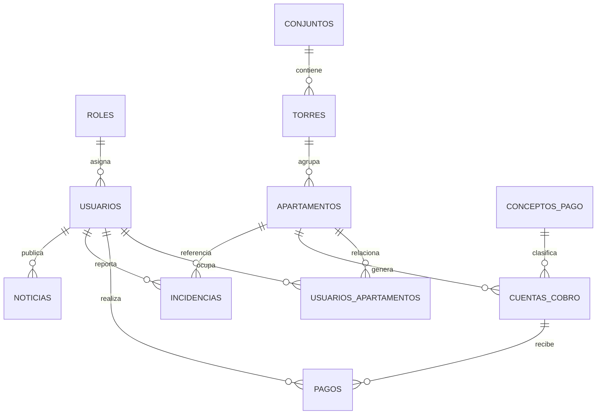

# Portada

**Servicio Nacional de Aprendizaje - SENA**  
**Analisis y Desarrollo de Software - ADSO**  
**Proyecto formativo:** TuConjunto App  
**Documento:** Estructura de base de datos en MySQL  
**Aprendiz:** [Completar nombre del aprendiz]  
**Instructor:** [Completar nombre del instructor]  
**Fecha:** 2026-04-13  
**Ciudad:** [Completar ciudad]

---

# Introduccion

TuConjunto App es una aplicacion orientada a la administracion de conjuntos residenciales. De acuerdo con los modulos evidenciados en el proyecto actual, el sistema debe permitir la gestion de usuarios, apartamentos, pagos de administracion, reportes de incidencias y publicacion de noticias para los residentes.

Con base en estas necesidades se propone una base de datos relacional en MySQL, estructurada con llaves primarias, llaves foraneas, restricciones de unicidad y validaciones de negocio basicas. El objetivo es asegurar integridad, consistencia y facilidad de crecimiento del sistema.

# Objetivo

## Objetivo general

Disenar la estructura de la base de datos del proyecto TuConjunto App, definiendo tablas, atributos, tipos de datos y restricciones necesarias para soportar las funcionalidades del software.

## Objetivos especificos

1. Identificar las entidades principales del sistema.
2. Definir atributos y tipos de datos apropiados para cada entidad.
3. Establecer llaves primarias y llaves foraneas para relacionar la informacion.
4. Aplicar restricciones de integridad como `NOT NULL`, `UNIQUE`, `CHECK` y `ENUM`.
5. Facilitar la implementacion del modelo en MySQL Workbench y en el backend JDBC del proyecto.

# Alcance del modelo

El diseno propuesto cubre los modulos funcionales que ya aparecen en la aplicacion:

1. Gestion de usuarios y roles.
2. Registro de conjuntos, torres y apartamentos.
3. Asociacion de residentes con apartamentos.
4. Gestion de cuentas de cobro y pagos.
5. Registro y seguimiento de incidencias.
6. Publicacion de noticias del conjunto.

# Modelo relacional propuesto

## Entidades principales

1. `roles`
2. `conjuntos`
3. `torres`
4. `apartamentos`
5. `usuarios`
6. `usuarios_apartamentos`
7. `conceptos_pago`
8. `cuentas_cobro`
9. `pagos`
10. `incidencias`
11. `noticias`

## Diagrama logico de referencia

# Diccionario de datos

## Tabla `roles`

| Campo | Tipo de dato | Restricciones | Descripcion |
|---|---|---|---|
| `id_rol` | `INT` | `PK`, `AUTO_INCREMENT`, `NOT NULL` | Identificador del rol. |
| `nombre` | `VARCHAR(30)` | `NOT NULL`, `UNIQUE` | Nombre del rol. |
| `descripcion` | `VARCHAR(120)` | `NULL` | Explicacion del rol. |
| `estado` | `ENUM('ACTIVO','INACTIVO')` | `NOT NULL`, `DEFAULT 'ACTIVO'` | Estado del rol. |

## Tabla `conjuntos`

| Campo | Tipo de dato | Restricciones | Descripcion |
|---|---|---|---|
| `id_conjunto` | `INT` | `PK`, `AUTO_INCREMENT`, `NOT NULL` | Identificador del conjunto. |
| `nombre` | `VARCHAR(100)` | `NOT NULL`, `UNIQUE` | Nombre del conjunto residencial. |
| `nit` | `VARCHAR(20)` | `UNIQUE`, `NULL` | NIT del conjunto. |
| `direccion` | `VARCHAR(150)` | `NOT NULL` | Direccion principal. |
| `ciudad` | `VARCHAR(60)` | `NOT NULL` | Ciudad donde se ubica. |
| `telefono` | `VARCHAR(20)` | `NULL` | Telefono de contacto. |
| `email_contacto` | `VARCHAR(100)` | `NULL`, `CHECK` | Correo institucional del conjunto. |
| `estado` | `ENUM('ACTIVO','INACTIVO')` | `NOT NULL`, `DEFAULT 'ACTIVO'` | Estado del registro. |
| `fecha_registro` | `TIMESTAMP` | `NOT NULL`, `DEFAULT CURRENT_TIMESTAMP` | Fecha de creacion. |

## Tabla `torres`

| Campo | Tipo de dato | Restricciones | Descripcion |
|---|---|---|---|
| `id_torre` | `INT` | `PK`, `AUTO_INCREMENT`, `NOT NULL` | Identificador de la torre. |
| `id_conjunto` | `INT` | `FK`, `NOT NULL` | Relacion con el conjunto. |
| `nombre` | `VARCHAR(30)` | `NOT NULL` | Nombre o letra de la torre. |
| `cantidad_pisos` | `INT` | `NOT NULL`, `DEFAULT 1`, `CHECK > 0` | Numero de pisos. |
| `estado` | `ENUM('ACTIVA','INACTIVA')` | `NOT NULL`, `DEFAULT 'ACTIVA'` | Estado de la torre. |

Relacion: `torres.id_conjunto` referencia `conjuntos.id_conjunto`.

## Tabla `apartamentos`

| Campo | Tipo de dato | Restricciones | Descripcion |
|---|---|---|---|
| `id_apartamento` | `INT` | `PK`, `AUTO_INCREMENT`, `NOT NULL` | Identificador del apartamento. |
| `id_torre` | `INT` | `FK`, `NOT NULL` | Torre a la que pertenece. |
| `numero` | `VARCHAR(10)` | `NOT NULL` | Numero del apartamento. |
| `piso` | `INT` | `NOT NULL`, `CHECK >= 0` | Piso de ubicacion. |
| `coeficiente` | `DECIMAL(6,2)` | `NOT NULL`, `DEFAULT 0.00`, `CHECK >= 0` | Coeficiente de administracion. |
| `estado` | `ENUM('DISPONIBLE','OCUPADO','INACTIVO')` | `NOT NULL`, `DEFAULT 'DISPONIBLE'` | Estado del apartamento. |

Relacion: `apartamentos.id_torre` referencia `torres.id_torre`.

## Tabla `usuarios`

| Campo | Tipo de dato | Restricciones | Descripcion |
|---|---|---|---|
| `id_usuario` | `INT` | `PK`, `AUTO_INCREMENT`, `NOT NULL` | Identificador del usuario. |
| `id_rol` | `INT` | `FK`, `NOT NULL` | Rol del usuario. |
| `nombres` | `VARCHAR(60)` | `NOT NULL` | Nombres del usuario. |
| `apellidos` | `VARCHAR(60)` | `NOT NULL` | Apellidos del usuario. |
| `tipo_documento` | `ENUM('CC','CE','TI','PASAPORTE')` | `NOT NULL`, `DEFAULT 'CC'` | Tipo de documento. |
| `numero_documento` | `VARCHAR(20)` | `NOT NULL`, `UNIQUE` | Numero del documento. |
| `correo` | `VARCHAR(100)` | `NOT NULL`, `UNIQUE`, `CHECK` | Correo electronico. |
| `password_hash` | `VARCHAR(255)` | `NOT NULL` | Contrasena cifrada. |
| `telefono` | `VARCHAR(20)` | `NULL` | Numero de contacto. |
| `estado` | `ENUM('ACTIVO','INACTIVO','BLOQUEADO')` | `NOT NULL`, `DEFAULT 'ACTIVO'` | Estado del usuario. |
| `fecha_registro` | `TIMESTAMP` | `NOT NULL`, `DEFAULT CURRENT_TIMESTAMP` | Fecha de creacion. |
| `ultimo_acceso` | `DATETIME` | `NULL` | Ultimo ingreso al sistema. |

Relacion: `usuarios.id_rol` referencia `roles.id_rol`.

## Tabla `usuarios_apartamentos`

| Campo | Tipo de dato | Restricciones | Descripcion |
|---|---|---|---|
| `id_usuario_apartamento` | `INT` | `PK`, `AUTO_INCREMENT`, `NOT NULL` | Identificador de la relacion. |
| `id_usuario` | `INT` | `FK`, `NOT NULL` | Usuario relacionado. |
| `id_apartamento` | `INT` | `FK`, `NOT NULL` | Apartamento relacionado. |
| `tipo_residencia` | `ENUM('PROPIETARIO','ARRENDATARIO','RESIDENTE')` | `NOT NULL` | Tipo de ocupacion. |
| `fecha_inicio` | `DATE` | `NOT NULL` | Fecha de inicio de la relacion. |
| `fecha_fin` | `DATE` | `NULL`, `CHECK` | Fecha final de ocupacion. |
| `es_principal` | `BOOLEAN` | `NOT NULL`, `DEFAULT TRUE` | Indica si es el ocupante principal. |

Relaciones:

1. `usuarios_apartamentos.id_usuario` referencia `usuarios.id_usuario`.
2. `usuarios_apartamentos.id_apartamento` referencia `apartamentos.id_apartamento`.

## Tabla `conceptos_pago`

| Campo | Tipo de dato | Restricciones | Descripcion |
|---|---|---|---|
| `id_concepto` | `INT` | `PK`, `AUTO_INCREMENT`, `NOT NULL` | Identificador del concepto. |
| `nombre` | `VARCHAR(50)` | `NOT NULL`, `UNIQUE` | Nombre del cobro. |
| `descripcion` | `VARCHAR(150)` | `NULL` | Detalle del concepto. |
| `periodicidad` | `ENUM('MENSUAL','EXTRAORDINARIA','ANUAL','UNICA')` | `NOT NULL`, `DEFAULT 'MENSUAL'` | Frecuencia de cobro. |
| `valor_base` | `DECIMAL(10,2)` | `NOT NULL`, `DEFAULT 0.00`, `CHECK >= 0` | Valor base sugerido. |
| `estado` | `ENUM('ACTIVO','INACTIVO')` | `NOT NULL`, `DEFAULT 'ACTIVO'` | Estado del concepto. |

## Tabla `cuentas_cobro`

| Campo | Tipo de dato | Restricciones | Descripcion |
|---|---|---|---|
| `id_cuenta_cobro` | `INT` | `PK`, `AUTO_INCREMENT`, `NOT NULL` | Identificador de la cuenta. |
| `id_apartamento` | `INT` | `FK`, `NOT NULL` | Apartamento al que se factura. |
| `id_concepto` | `INT` | `FK`, `NOT NULL` | Concepto de pago asociado. |
| `periodo` | `DATE` | `NOT NULL` | Periodo facturado, por ejemplo primer dia del mes. |
| `fecha_emision` | `DATE` | `NOT NULL` | Fecha de emision del cobro. |
| `fecha_vencimiento` | `DATE` | `NOT NULL`, `CHECK >= fecha_emision` | Fecha maxima de pago. |
| `valor_total` | `DECIMAL(10,2)` | `NOT NULL`, `CHECK > 0` | Valor total a pagar. |
| `saldo_pendiente` | `DECIMAL(10,2)` | `NOT NULL`, `CHECK >= 0` | Saldo pendiente del cobro. |
| `estado` | `ENUM('PENDIENTE','PAGADA','VENCIDA','ANULADA')` | `NOT NULL`, `DEFAULT 'PENDIENTE'` | Estado de la cuenta. |
| `observaciones` | `VARCHAR(200)` | `NULL` | Comentarios adicionales. |

Relaciones:

1. `cuentas_cobro.id_apartamento` referencia `apartamentos.id_apartamento`.
2. `cuentas_cobro.id_concepto` referencia `conceptos_pago.id_concepto`.

## Tabla `pagos`

| Campo | Tipo de dato | Restricciones | Descripcion |
|---|---|---|---|
| `id_pago` | `INT` | `PK`, `AUTO_INCREMENT`, `NOT NULL` | Identificador del pago. |
| `id_cuenta_cobro` | `INT` | `FK`, `NOT NULL` | Cuenta de cobro pagada. |
| `id_usuario` | `INT` | `FK`, `NOT NULL` | Usuario que realiza el pago. |
| `fecha_pago` | `DATETIME` | `NOT NULL`, `DEFAULT CURRENT_TIMESTAMP` | Fecha y hora del pago. |
| `valor_pagado` | `DECIMAL(10,2)` | `NOT NULL`, `CHECK > 0` | Valor pagado. |
| `medio_pago` | `ENUM('EFECTIVO','TRANSFERENCIA','PSE','TARJETA')` | `NOT NULL` | Canal de pago. |
| `referencia_transaccion` | `VARCHAR(80)` | `UNIQUE`, `NULL` | Referencia bancaria o virtual. |
| `estado` | `ENUM('PENDIENTE','APROBADO','RECHAZADO')` | `NOT NULL`, `DEFAULT 'PENDIENTE'` | Estado del pago. |
| `comprobante_url` | `VARCHAR(255)` | `NULL` | Ruta del comprobante de pago. |

Relaciones:

1. `pagos.id_cuenta_cobro` referencia `cuentas_cobro.id_cuenta_cobro`.
2. `pagos.id_usuario` referencia `usuarios.id_usuario`.

## Tabla `incidencias`

| Campo | Tipo de dato | Restricciones | Descripcion |
|---|---|---|---|
| `id_incidencia` | `INT` | `PK`, `AUTO_INCREMENT`, `NOT NULL` | Identificador del reporte. |
| `id_usuario_reporta` | `INT` | `FK`, `NOT NULL` | Usuario que reporta. |
| `id_apartamento` | `INT` | `FK`, `NULL` | Apartamento asociado al reporte. |
| `categoria` | `ENUM('RUIDO','DANOS','ILUMINACION','SEGURIDAD','OTRO')` | `NOT NULL` | Tipo de incidencia. |
| `titulo` | `VARCHAR(100)` | `NOT NULL` | Titulo del reporte. |
| `descripcion` | `TEXT` | `NOT NULL` | Explicacion detallada. |
| `prioridad` | `ENUM('BAJA','MEDIA','ALTA')` | `NOT NULL`, `DEFAULT 'MEDIA'` | Prioridad de atencion. |
| `estado` | `ENUM('ABIERTA','EN_PROCESO','CERRADA','CANCELADA')` | `NOT NULL`, `DEFAULT 'ABIERTA'` | Estado del caso. |
| `ubicacion` | `VARCHAR(120)` | `NULL` | Lugar donde ocurre la novedad. |
| `fecha_reporte` | `DATETIME` | `NOT NULL`, `DEFAULT CURRENT_TIMESTAMP` | Fecha de reporte. |
| `fecha_cierre` | `DATETIME` | `NULL`, `CHECK` | Fecha de cierre. |

Relaciones:

1. `incidencias.id_usuario_reporta` referencia `usuarios.id_usuario`.
2. `incidencias.id_apartamento` referencia `apartamentos.id_apartamento`.

## Tabla `noticias`

| Campo | Tipo de dato | Restricciones | Descripcion |
|---|---|---|---|
| `id_noticia` | `INT` | `PK`, `AUTO_INCREMENT`, `NOT NULL` | Identificador de la noticia. |
| `id_usuario_autor` | `INT` | `FK`, `NOT NULL` | Usuario que publica. |
| `titulo` | `VARCHAR(120)` | `NOT NULL` | Encabezado de la noticia. |
| `contenido` | `TEXT` | `NOT NULL` | Informacion publicada. |
| `fecha_publicacion` | `DATETIME` | `NOT NULL`, `DEFAULT CURRENT_TIMESTAMP` | Fecha de publicacion. |
| `fecha_expiracion` | `DATETIME` | `NULL`, `CHECK` | Fecha limite de vigencia. |
| `prioridad` | `ENUM('BAJA','MEDIA','ALTA')` | `NOT NULL`, `DEFAULT 'MEDIA'` | Nivel de prioridad. |
| `publicada` | `BOOLEAN` | `NOT NULL`, `DEFAULT TRUE` | Control de visibilidad. |

Relacion: `noticias.id_usuario_autor` referencia `usuarios.id_usuario`.

# Restricciones principales del modelo

## Llaves primarias

Cada tabla posee una llave primaria tipo `INT AUTO_INCREMENT` para garantizar identificadores unicos y facilitar las relaciones entre entidades.

## Llaves foraneas

Las llaves foraneas garantizan la integridad referencial entre las tablas. Ejemplos:

1. Un usuario debe tener un rol valido.
2. Un apartamento debe pertenecer a una torre existente.
3. Una cuenta de cobro debe pertenecer a un apartamento y a un concepto de pago existente.
4. Un pago no puede existir sin una cuenta de cobro previa.
5. Una incidencia debe estar asociada a un usuario que la reporta.

## Restricciones de unicidad

Se aplican restricciones `UNIQUE` en campos que no deben repetirse:

1. Nombre del rol.
2. Nombre del conjunto.
3. Documento y correo del usuario.
4. Combinacion de torre y numero de apartamento.
5. Concepto de pago.
6. Referencia de transaccion del pago.

## Restricciones de validacion

Se implementan restricciones `CHECK` para proteger la calidad de los datos:

1. Valores monetarios mayores o iguales a cero.
2. Fechas de cierre posteriores a las fechas de registro.
3. Fecha de vencimiento mayor o igual a fecha de emision.
4. Cantidad de pisos mayor que cero.
5. Correos con formato basico que incluya `@`.

# Justificacion del diseno

El modelo se plantea de forma modular para responder a las funciones actuales del sistema:

1. `usuarios` y `roles` soportan autenticacion y perfiles.
2. `conjuntos`, `torres` y `apartamentos` representan la estructura fisica del conjunto residencial.
3. `usuarios_apartamentos` permite manejar propietarios, arrendatarios y residentes sin duplicar datos.
4. `conceptos_pago`, `cuentas_cobro` y `pagos` cubren el ciclo de facturacion y recaudo.
5. `incidencias` y `noticias` responden a los modulos visibles en el frontend.

# Implementacion en MySQL Workbench

Para cumplir el requerimiento del diseno en MySQL Workbench se recomienda el siguiente procedimiento:

1. Abrir MySQL Workbench y seleccionar `File > New Model`.
2. Crear un esquema llamado `tuconjuntoapp`.
3. Agregar cada una de las once tablas definidas en este documento.
4. Configurar en cada tabla la llave primaria con `PK`, `NN` y `AI`.
5. Marcar las columnas obligatorias con `NN` y las unicas con `UQ`.
6. Definir las relaciones en la pestana `Foreign Keys` segun el modelo propuesto.
7. Ajustar las acciones `ON UPDATE` y `ON DELETE` de acuerdo con el script SQL.
8. Generar el diagrama EER para visualizar el modelo.
9. Usar la opcion `Database > Forward Engineer` para crear fisicamente la base de datos.

# Archivo SQL asociado

El script completo de creacion del esquema fue almacenado en:

`Backend/TuConjuntoJDBC/database/tuconjuntoapp_schema.sql`

Este archivo contiene:

1. Creacion de la base de datos.
2. Creacion de tablas.
3. Llaves primarias.
4. Llaves foraneas.
5. Restricciones `UNIQUE` y `CHECK`.
6. Indices de apoyo.
7. Datos iniciales para roles y conceptos de pago.

# Conclusiones

La base de datos propuesta responde a las necesidades funcionales identificadas en TuConjunto App y establece una estructura consistente para el desarrollo del backend en Java con JDBC y la administracion visual del modelo en MySQL Workbench.

Ademas de organizar la informacion del conjunto residencial, el modelo asegura integridad referencial, evita duplicidades y prepara al proyecto para futuras ampliaciones, como reservas de zonas comunes, comunicados internos o control de visitantes.
